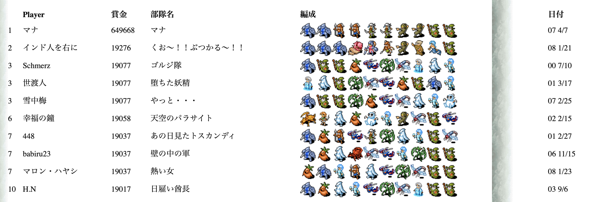

# EchoRulerClone.js

## これってなに？

- waki 氏が作製し、2008年頃まで運営されていた EchoRuler のクローン実装です
  - コア部分のみの実装です。ゲームインタフェースは提供していません
  - コードの仕様を読み解き、現代向けに再実装してあります
  - バグがあるかもしれません
- ゲーム中で使われていたアイコンは「クルセユタカ」(クルセード)氏の著作物です
  - かつてスクウェア・エニックスに在籍していたと思われる[記事](http://remoon.blog15.fc2.com/blog-entry-27214.html)がありますが、現在の消息は不明です
  - アイコン自体は [EchoRuler Tactical Simulation](https://www.vector.co.jp/soft/win95/game/se240127.html) からサルベージ可能です

## バグを見つけた！

- Issues に投稿してください
- その際は元実装との差異の詳細を記載してください

## 説明されていない仕様

### 攻撃関連

- STUN 状態か、SLOW 状態か、攻撃射程内に敵陣が含まれない場合には攻撃ができません
  - 「何もできない。」と表示されます
- Chimera の攻撃は3-Headとなっていますが、これはファイアブレス・デストラクション・キラーファングの三連撃です

### 射程関連

- 攻撃対象は単純な幅優先探索(BFS)ではなく、独自のテーブルに基づく優先順位で決定されます
- FreeMove を持つキャラクターは最低射程が3となり、攻撃が遠距離攻撃扱いになります
  - どこに配置しても射程内に敵陣が含まれるので、少なくとも誰かには攻撃できます
- Sorcerer のクラックブラストは対地広域となっていますが、これは敵全体攻撃です。ただし、飛行を持つキャラクターには5%のダメージになります
- Sorceress のウインドストームは対空貫通となっていますが、これは敵全体攻撃です。ただし、飛行を持たないキャラクターには5%のダメージになります

### 効果関連

- SLOW または STUN 状態になるとそのターンの間、攻撃ができなくなります
  - そのため、自分より行動順が早いキャラクターを SLOW 状態または STUN 状態にすることには意味がありません
- POISON 状態になると、行動前に最大HPの 20% のダメージを受けます
- CURSE 状態になると攻撃力が 50% になります (補正前の本来の攻撃力に適用)
  - CURSE 効果は対地・対空補正効果と重複します
- PARALYZE または STONE 状態になると即死します
  - ただし、PARALYZE の即死効果は廃止されています
- BD_LURGE(大型)を持つキャラクターは、SLOW, STUN, PARALYZE, STONE を受けません
  - ほとんどのボスキャラクターが対象です。綴りはおそらくLARGEの誤り
- BD_NONERVE(頭脳や精神を持たない)を持つキャラクターは、POISON, CURSE, PARALYZE, STONE を受けません
  - 原始生物・精霊・外来生物などが対象です

## その他の仕様

### 未実装

- Imp のウェットネイルには DISEASE 状態になる効果がありますが、DISEASE の効果は実装されていません
- FlyingPolyp はデータ上は存在していますが、出現するステージはありません

### 考慮漏れ？

- 遠距離攻撃(FreeMove 含む)を持つキャラクターの攻撃は、相手陣営で同じY座標の前衛が存在しないと射程が 1 増加します
  - この効果は通常の射程延長ルールとは別に発生します

### 元ネタ不明

- DarkYoungの武器「サーリッド」の元ネタが不明です
- OldOneの武器「リ・ファ」の元ネタが不明です
  - 武器の説明文からおそらく不思議な音の意で、特に深い意味はないと推測

# ゲームプレイについて

## フィールドパワー

- 攻撃属性とフィールド属性によってフィールドパワーと属性が変化する仕組みです
- 属性攻撃をすると、フィールドパワーが攻撃属性に変化して、以下の表に示すだけフィールドパワーが増加します
  - 射程不足で攻撃ができなくても、攻撃が実行されるとフィールドパワーは変化します
    - (例)後列にいる DeepPaste が「何もできない。」場合でもフィールドパワーは水に変化します
  - また、元の攻撃力に対して、以下の表の10%がフィールドパワーが加算されます
    - (例)フィールドが火50のときに、Undine が攻撃したときは、火50 × 400% + 水40 × 40% = 水216 となります

| フィールド＼攻撃 | 火 | 風 | 水 | 地 | 心 |
| -- | -- | -- | -- | -- | -- |
| 火 | 100% | 200% | 400% |   0% |  50% |
| 風 |  50% | 100% | 200% | 400% |   0% |
| 水 |   0% |  50% | 100% | 200% | 400% |
| 地 | 400% |   0% |  50% | 100% | 200% |
| 心 | 200% | 400% |   0% |  50% | 100% |

## 眷属へのダメージ倍率

- 眷属やドラゴンなど特定の属性に属するキャラクターは受ける属性ダメージが変化します。
  - 火: Phoenix, LavaLizard, Salamander, Jacko'Lantern, Cerberus, RedDragon
  - 水: Undine, Mermaid
  - 風: Sylph, BlueDragon
  - 地: FreezeSour, Snow, SnowMan, AlbinoPenguin, WhiteDragon
  - 心: (なし)

| 防御＼攻撃 | 火 | 風 | 水 | 地 | 心 |
| -- | -- | -- | -- | -- | -- |
| 火 |   5% | 100% | 200% | 200% | 100% |
| 風 | 100% |   5% | 100% | 200% | 200% |
| 水 | 200% | 100% |   5% | 100% | 200% |
| 地 | 200% | 200% | 100% |   5% | 100% |
| 心 | 100% | 200% | 200% | 100% |   5% |

## 左ルートにしか進めないんですけど？

- ゲームシステムに習熟していないと、力任せでクリアする左ルートに誘導されやすくなります
- 捕虜も属性攻撃を持たないキャラクターが多いので、フィールドパワーによる支援も得にくくなります

## F.歪んだ大樹がクリアできないんですが？

- かなり難しめに設計されています。特定のキャラクターが攻略に必須になっているので、いろいろ試してみてください

## 当時のハイスコアを教えて！

- 19077が推定理論値です
- 19276は不正なスコアです
  - なぜなら、RuneKnight が手に入る H.天空の戦士 ルートのスコアは最大でも18900となるからです

## スコア計算

また、スコアは各ステージ以下のようになっており、ステージ終了後に各キャラクターの回復に必要なHpが差し引かれて実際のスコアが算出されます。

- A.森の守護者(2000) → B, C に侵攻可能
  - B.岩山の飛竜(2500) → D, E に侵攻可能
  - C.迷宮の落胤(2700) → E, F に侵攻可能
    - D.岩礁の流影(3000) → G, H に侵攻可能
    - E.遺跡の巨像(3200) → H, I に侵攻可能
    - F.歪んだ大樹(3500) → I, J に侵攻可能
      - G.多腕の闘鬼(4000) → K, L, M に侵攻可能
      - H.天空の戦士(4000) → K, L, M に侵攻可能
      - I.魔道生命体(4400) → K, L, M に侵攻可能
      - J.古の支配者(4800) → K, L, M に侵攻可能
- K.灼熱の火炎(5000) → ゲーム終了
- L.天空の稲妻(6000) → ゲーム終了
- M.白銀の吹雪(7000) → ゲーム終了

となっており、最小値は16500で、最大値は20000となっています。

## わかっていること

- A.森の守護者での最小の損害は180ダメージで、1820gp獲得が最適解です
- C.迷宮の落胤での最小の損害は100ダメージで、2600gp獲得が最適解です
- F.歪んだ大樹での最小の損害は540ダメージで、2960pt獲得が最適解です
- J.古の支配者での最小の損害は130ダメージで、4670gp獲得が最適解です
- M.白銀の吹雪での最小の損害は149ダメージで、6851gp獲得が最適解です

> 合計すると、18901gpです。……アレ？🙄残りの176gpはいずこ？

# あまり聞かないで欲しいこと

## かつての実装を動かしたいんですが？

- 私は提供しませんが、[Wayback Machine](https://web.archive.org/web/20071022015853/http://www2.big.or.jp/~waki/echo/) で最低限必要なコード一式はサルベージ可能です
  - 当時なので文字エンコーディングは Shift_JIS です
- Netscape Navigator 4 向けになっているコードを修正すると動くようになります
